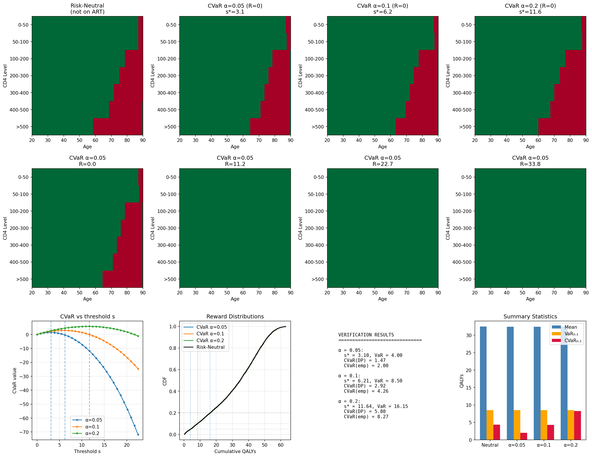

# Risk-Sensitive MDPs for HIV Treatment Initiation

This repository implements two risk-sensitive optimization approaches for a Markov Decision Process modeling HIV treatment initiation:

1. **Static CVaR** (Bauerle and Ott, 2011): Maximizes Conditional Value-at-Risk using Rockafellar-Uryasev representation
2. **QMDP** (Li et al., 2022): Maximizes quantiles of cumulative reward via threshold-based DP

## Problem Setting

A patient diagnosed with HIV must decide when to initiate antiretroviral therapy (ART). The state space includes:
- CD4 cell count (7 discrete levels)
- ART treatment duration (0 = not started, 1-8 = periods on ART)
- Age (determines background mortality)

At each 6-month decision epoch, patients not yet on ART choose between:
- **Wait**: Higher immediate utility but CD4 decline and HIV mortality risk
- **Start ART**: Lower immediate utility but CD4 recovery and reduced HIV mortality

Once ART is initiated, it continues indefinitely. The objective is to maximize risk-adjusted lifetime QALYs (Quality-Adjusted Life Years).

## CVaR Formulation

For a random cumulative reward $R$, the lower-tail CVaR at level $\alpha \in (0,1)$ is:

$$
\text{CVaR}_\alpha(R) = \mathbb{E}[R \mid R \leq \text{VaR}_\alpha(R)]
$$

where $\text{VaR}_\alpha(R)$ is the $\alpha$-quantile of $R$.

### Rockafellar-Uryasev Representation

CVaR admits the dual representation (Rockafellar and Uryasev, 2000):

$$
\text{CVaR}_\alpha(R) = \max_{s \in \mathbb{R}} \{ s + \frac{1}{\alpha} \mathbb{E}[\min(R - s, 0)] \}
$$

The optimal $s^\*$ satisfies $s^\* = \text{VaR}_\alpha(R)$.

### Augmented State Space (Bauerle and Ott, 2011)

To optimize static CVaR over a multi-period MDP, we augment the state with the cumulative reward. Define:

$$
W_t(x, r, s) = \mathbb{E}\left[\min\left(\sum_{\tau=t}^{T} R_\tau + r - s, 0\right) \;\middle|\; X_t = x\right]
$$

where $x$ is the original state (CD4, ART duration), $r$ is the cumulative reward so far, and $s$ is the threshold parameter.

The Bellman recursion for $W$ is:

$$
W_t(x, r, s) = \max_{a \in A(x)} \sum_{x'} P(x' \mid x, a) \cdot W_{t+1}(x', r + R(x,a), s)
$$

with terminal condition:

$$
W_T(x, r, s) = \min(r - s, 0)
$$

The CVaR-optimal policy is obtained by:
1. For each threshold $s$ on a grid, solve the augmented DP to get $W_0(x_0, 0, s)$
2. Compute the objective $\phi(s) = s + \frac{1}{\alpha} W_0(x_0, 0, s)$
3. Select $s^\* = \arg\max_s \phi(s)$
4. Return the policy from step 1 evaluated at $s^\*$

## Implementation Details

### Reward Discretization

The cumulative reward $r$ is discretized into bins. The bin index is computed using rounding (not floor) to avoid systematic underestimation:

```python
bin_index = round(r / bin_width)
```

This reduces discretization error from ~60% to ~10% over a 140-step horizon.

### Death Model

If death occurs during a period, the reward for that period is halved (uniform death time assumption):

$$
R_{\text{period}} = \begin{cases}
r & \text{if survive} \\
r/2 & \text{if die}
\end{cases}
$$

### Mortality Combination

HIV mortality and background mortality are combined assuming independence:

$$
p_{\text{total}} = 1 - (1 - p_{\text{HIV}})(1 - p_{\text{background}})
$$

Background mortality uses WHO Life Tables 2016 for US females (cached in `who_bg_mort_6mo_USA_FMLE_2016.json`).

## Results



The figure shows:
- **Top row**: Policy heatmaps (green = start ART, red = wait). Risk-neutral and CVaR policies are nearly identical for this initiation problem.
- **Bottom left**: Rockafellar-Uryasev objective $\phi(s)$ vs threshold $s$. The peak occurs at $s^\* \approx \text{VaR}_\alpha$.
- **Bottom center**: Cumulative distribution of total QALYs under each policy.
- **Bottom right**: Summary statistics (mean, VaR, CVaR) for each policy.

### Verification

The implementation includes consistency checks:

1. **$s^\* \approx \text{VaR}_\alpha$**: The optimal threshold should equal the empirical $\alpha$-quantile
2. **DP = MC shortfall**: The dynamic programming value $\mathbb{E}[\min(R-s,0)]$ should match Monte Carlo estimates
3. **Monotonicity**: $`\mathrm{CVaR}_{\alpha_1} \le \mathrm{CVaR}_{\alpha_2}`$ for $`\alpha_1 < \alpha_2`$

## QMDP Formulation

QMDP maximizes the \(\tau\)-quantile of cumulative reward \(R\):

\[
\max_\pi Q_\tau(R^\pi)
\]

where \(Q_\tau\) denotes the \(\tau\)-quantile.

### Threshold-Based Algorithm

For threshold \(z\), define the exceedance probability:

\[
V_t(x, r) = \max_\pi \mathbb{P}(R \geq z \mid X_t = x, \text{cumulative reward} = r)
\]

The Bellman recursion is:

\[
V_t(x, r) = \max_{a \in A(x)} \sum_{x'} P(x' \mid x, a) \cdot V_{t+1}(x', r + R(x,a))
\]

with terminal condition \(V_T(x, r) = \mathbf{1}[r \geq z]\).

The optimal \(\tau\)-quantile is:

\[
z^* = \max\{z : V_0(x_0, 0) \geq 1 - \tau\}
\]

### QMDP Results


The figure shows:
- **Top row**: Policy heatmaps for different \(\tau\) values. Gray = delay ART, brown = start ART.
  - \(\tau = 0.20\) (risk averse): Delay ART at older ages for high CD4
  - \(\tau = 0.80\) (risk seeking): Start ART earlier across most states
- **Bottom**: QMDP achieves higher quantiles (brown) than risk-neutral MDP (gray dashed) for all \(\tau\).

## Usage

```bash
pip install -r requirements.txt

# Static CVaR
python static_cvar_hiv.py

# QMDP
python qmdp_hiv.py
```

Output:
- `cvar_thesis_results.png`: CVaR policy visualization
- `qmdp_results.png`: QMDP policy and quantile curve

## References

- Bauerle N, Ott J (2011). Markov Decision Processes with Average-Value-at-Risk criteria. *Mathematical Methods of Operations Research*, 74(3):361-379.

- Li Y, Zhong M, Marecki M, Makar M, Ghavamzadeh M (2022). Quantile Markov Decision Processes. *AISTATS 2022*.

- Rockafellar RT, Uryasev S (2000). Optimization of Conditional Value-at-Risk. *Journal of Risk*, 2(3):21-42.

- Zhong M (2020). Quantile Markov Decision Processes. PhD Thesis, University of Alberta.

